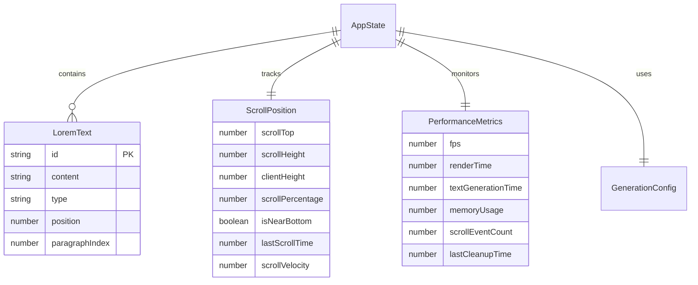

# Data Model: Lorem Ipsum Generator via Scrolling

**Feature**: 001-lorem-ipsum | **Date**: 2026-02-16  
**Purpose**: Define entities, relationships, and validation rules for the lorem ipsum generator

## Core Entities

### LoremText

Represents the generated lorem ipsum content and its metadata.

```typescript
interface LoremText {
  id: string;
  content: string; // The actual text content
  type: 'original' | 'generated'; // Original vs algorithmically generated
  position: number; // Position in the document (0-based index)
  paragraphIndex: number; // Paragraph number (1-based)
}
```

### ScrollPosition

Tracks the user's current scroll state and proximity to content boundaries.

```typescript
interface ScrollPosition {
  scrollTop: number; // Current scroll position from top
  scrollHeight: number; // Total scrollable height
  clientHeight: number; // Visible viewport height
  scrollPercentage: number; // Percentage scrolled (0-100)
  isNearBottom: boolean; // True when within 10% of bottom
  lastScrollTime: number; // Timestamp of last scroll event
  scrollVelocity: number; // Pixels per second
}
```

### PerformanceMetrics

Monitors real-time performance for optimization.

```typescript
interface PerformanceMetrics {
  fps: number; // Current frames per second
  renderTime: number; // Last render time in milliseconds
  textGenerationTime: number; // Time to generate text chunks
  memoryUsage: number; // Estimated memory usage in MB
  scrollEventCount: number; // Total scroll events processed
  lastCleanupTime: number; // Last time memory cleanup ran
}
```

### AppState

Global application state combining all entities.

```typescript
interface AppState {
  texts: LoremText[]; // All generated text segments
  currentPosition: ScrollPosition; // Current scroll state
  performance: PerformanceMetrics; // Performance monitoring
  isGenerating: boolean; // Text generation in progress
  wordBank: string[]; // Available words for generation
  config: GenerationConfig; // Generation settings
}
```

## Configuration Entities

### GenerationConfig

Settings for text generation behavior.

```typescript
interface GenerationConfig {
  scrollThreshold: number; // Percentage from bottom to trigger generation (0-100)
  wordsPerParagraph: { min: number; max: number };
  sentencesPerParagraph: { min: number; max: number };
  maxParagraphs: number; // Maximum paragraphs to generate
  chunkSize: number; // Words to generate per chunk
  seed: string; // Random seed for reproducible generation
}
```

## Entity Relationships



## State Transitions

### Scroll Position States

```typescript
type ScrollState =
  | { type: 'idle' } // No scrolling activity
  | { type: 'scrolling'; velocity: number } // Active scrolling
  | { type: 'near-bottom'; threshold: number } // Approaching content end
  | { type: 'generating'; chunkSize: number }; // Triggering text generation
```

### Text Generation States

```typescript
type GenerationState =
  | { type: 'idle' } // No generation needed
  | { type: 'triggered'; position: number } // Generation started
  | { type: 'generating'; progress: number } // Currently generating
  | { type: 'completed'; paragraphs: LoremText[] } // Generation finished
  | { type: 'error'; message: string }; // Generation failed
```

## Validation Rules

### LoremText Validation

```typescript
const validateLoremText = (text: Partial<LoremText>): ValidationResult => {
  const errors: string[] = [];

  if (!text.content || text.content.trim().length === 0) {
    errors.push('Content cannot be empty');
  }

  if (text.type && !['original', 'generated'].includes(text.type)) {
    errors.push('Type must be "original" or "generated"');
  }

  if (text.position !== undefined && text.position < 0) {
    errors.push('Position must be non-negative');
  }

  if (text.paragraphIndex !== undefined && text.paragraphIndex < 1) {
    errors.push('Paragraph index must be positive');
  }

  return { isValid: errors.length === 0, errors };
};
```

### ScrollPosition Validation

```typescript
const validateScrollPosition = (
  position: Partial<ScrollPosition>,
): ValidationResult => {
  const errors: string[] = [];

  if (position.scrollTop !== undefined && position.scrollTop < 0) {
    errors.push('Scroll top cannot be negative');
  }

  if (
    position.scrollPercentage !== undefined &&
    (position.scrollPercentage < 0 || position.scrollPercentage > 100)
  ) {
    errors.push('Scroll percentage must be between 0 and 100');
  }

  if (position.scrollVelocity !== undefined && position.scrollVelocity < 0) {
    errors.push('Scroll velocity cannot be negative');
  }

  return { isValid: errors.length === 0, errors };
};
```

## Data Access Patterns

### Text Generation Access

```typescript
interface TextGenerator {
  generateParagraph(count: number): LoremText[];
  generateSentence(wordCount: number): string;
  getNextPosition(): number;
  shouldGenerate(scrollPosition: ScrollPosition): boolean;
}
```

### Scroll Detection Access

```typescript
interface ScrollDetector {
  getCurrentPosition(): ScrollPosition;
  isNearBottom(threshold: number): boolean;
  getScrollVelocity(): number;
  subscribe(callback: (position: ScrollPosition) => void): () => void;
}
```

## Performance Considerations

### Memory Management

- **Text Storage**: Store only visible + buffer text in DOM, maintain full array in memory
- **Scroll Events**: Throttle to 60fps using requestAnimationFrame
- **Text Generation**: Generate in chunks to prevent blocking main thread
- **Cleanup**: Remove old text nodes when memory usage exceeds threshold

### Optimization Strategies

- **Virtual Scrolling**: Render only visible paragraphs + 2 paragraph buffer
- **Text Caching**: Cache generated paragraphs to avoid re-generation
- **Event Debouncing**: Debounce rapid scroll events for performance
- **Lazy Loading**: Generate text on-demand rather than pre-generating

## Integration Points

### React Hooks Integration

```typescript
// Custom hooks that encapsulate entity logic
const useLoremText = () => {
  /* ... */
};
const useScrollPosition = () => {
  /* ... */
};
const usePerformance = () => {
  /* ... */
};
```

### Component Props Interfaces

This data model provides a comprehensive foundation for implementing the lorem ipsum generator with proper type safety, validation, and performance considerations.
